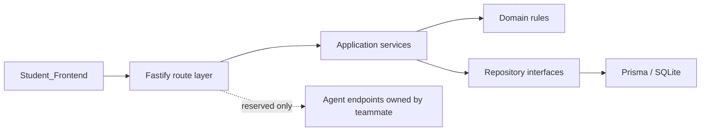

# NOME.AI Student Backend Design

**Date:** 2026-08-10

**Status:** Approved for planning

**Service directory:** `Student-Backend/`

**Scope owner:** Student-side non-Agent backend

## 1. Context

The repository already contains a React student frontend under `Student_Frontend/`. Its endpoint adapter and `API_INTERFACE.md` define a strict REST contract that can switch from local mock persistence to a real backend by setting `VITE_API_BASE_URL`.

The product document defines the student experience around:

- task and time management;
- a unified learning-material workspace;
- six-level progressive help;
- seven-category error diagnosis;
- A-Level and IELTS learning loops;
- personal notes, error cards, syllabus links, and mastery views;
- knowledge-graph and emotional-support capabilities.

This design creates a separate student backend while preserving the teammate-designed frontend layout. AI/Agent implementation is explicitly reserved for the teammate and is not part of this delivery.

## 2. Goals

1. Create an independently runnable `Student-Backend/` service.
2. Implement the non-Agent portion of the existing frontend/backend contract without requiring UI layout changes.
3. Persist student tasks, exercises, sessions, error-book records, notes, material-job metadata, and settings.
4. Provide deterministic validation, state transitions, transactions, error responses, and tests.
5. Establish explicit Agent boundaries so the teammate can add AI behavior without rewriting the core service.
6. Deliver in small modules. Each module must pass its focused tests and the full backend suite before it is committed and pushed.

## 3. Non-goals

This delivery will not implement:

- LLM calls, prompt orchestration, model selection, tool calling, or Multi-agent coordination;
- generation of the six progressive hint levels;
- automated seven-category error diagnosis;
- AI-generated A-Level or IELTS explanations;
- variant-question generation;
- OCR, document understanding, automatic material classification, or question/answer splitting;
- AI-generated note suggestions, syllabus mapping, knowledge-graph inference, or mastery prediction;
- AI task recommendation, emotional analysis, or pressure-risk inference;
- teacher-side services or frontend layout redesign;
- production authentication, authorization, billing, or multi-tenant administration.

## 4. Chosen approach

### 4.1 Technology

| Concern | Choice | Reason |
|---|---|---|
| Runtime | Node.js | Matches the existing JavaScript ecosystem and local tooling |
| Language | TypeScript | Enforces the strict frontend contract and reduces schema drift |
| HTTP framework | Fastify | Built-in request injection, schema support, structured logging, and low ceremony |
| Validation | Zod integrated at route boundaries | One explicit runtime/type contract for all request and response shapes |
| Persistence | Prisma with SQLite for the first delivery | Simple local startup, deterministic integration tests, and migration history |
| Testing | Vitest plus `fastify.inject` | Fast unit and real route-level integration tests without opening ports |
| API documentation | OpenAPI generated from registered schemas | Gives the teammate a discoverable Agent handoff surface |

Alternatives considered:

- JavaScript + Express would be faster to scaffold but would weaken contract enforcement and duplicate more validation work.
- Python + FastAPI would suit a future AI service but would split the current repository across two ecosystems before the Agent implementation exists.

### 4.2 API compatibility

The backend keeps the current `/api/...` paths exactly as documented by `Student_Frontend/API_INTERFACE.md`. It does not introduce an incompatible `/api/v1` prefix in this delivery.

Successful responses use:

```json
{
  "code": 0,
  "message": "ok",
  "data": {}
}
```

Errors use the relevant HTTP status and a stable string code:

```json
{
  "code": "INVALID_INPUT",
  "message": "Task id is required",
  "data": null
}
```

The backend must preserve the error codes already understood by the frontend, including `INVALID_INPUT`, `NOT_FOUND`, `DUPLICATE_ID`, `MASTERY_GATE_NOT_MET`, material lifecycle codes, and note-version codes.

## 5. Architecture

The service is a modular monolith. Routes validate transport input, services enforce business state transitions, and repositories own persistence. Modules may not read another module's tables directly; cross-module work goes through an application service and one database transaction.



Planned directory structure:

```text
Student-Backend/
|-- prisma/
|   |-- schema.prisma
|   |-- migrations/
|   `-- seed.ts
|-- src/
|   |-- app.ts
|   |-- server.ts
|   |-- config/
|   |-- common/
|   |   |-- errors/
|   |   |-- http/
|   |   `-- validation/
|   `-- modules/
|       |-- bootstrap/
|       |-- tasks/
|       |-- exercises/
|       |-- sessions/
|       |-- errors/
|       |-- notes/
|       |-- materials/
|       `-- settings/
|-- test/
|   |-- helpers/
|   `-- contract/
|-- .env.example
|-- package.json
|-- prisma.config.ts
|-- tsconfig.json
`-- README.md
```

There will be no Agent implementation directory in this phase. The handoff is represented by documented routes and schemas so ownership is unambiguous.

## 6. Module ownership and endpoint scope

| Module | Implement now | Endpoint scope | Agent teammate owns |
|---|---|---|---|
| Foundation | Configuration, health, CORS, logging, response envelope, error mapping, OpenAPI, migrations, seed, test harness | `GET /health` | None |
| Bootstrap | Load the current student's complete application state | `GET /api/student/bootstrap` | Dynamic-model inference |
| Settings | Persist daily goal and reminder preferences | `PATCH /api/student/settings` | None |
| Tasks | Create, complete, and request schedule adjustment; preserve teacher-task precedence as stored data | `POST /api/tasks`, `PATCH /api/tasks/{id}`, `POST /api/tasks/{id}/adjustment-request` | AI task generation and intelligent priority calculation |
| Exercises | Read task and bank exercise sets | `GET /api/exercise-sets/{taskId}`, `GET /api/bank/exercise/{setId}` | Generated explanations, hints, and questions |
| Sessions | Persist a complete attempt and calculate a deterministic summary from submitted evidence | `POST /api/sessions`, `GET /api/summary/{sessionId}` | Semantic grading or feedback generation |
| Error book | Atomically upsert supplied error evidence; record redo, verification, and mastery transitions | `POST /api/errors/batch`, `POST /api/errors/{id}/redo`, `POST /api/errors/{id}/verification`, `PATCH /api/errors/{id}` | Error diagnosis and variant generation |
| Notes | List, create, edit, version, undo, and apply already-present suggestions | `GET /api/notes`, `POST /api/notes`, `PATCH /api/notes/{id}`, `POST /api/notes/{id}/organize`, `POST /api/notes/{id}/undo` | Suggestion generation and automatic linking |
| Materials | Persist metadata-only jobs, cancel jobs, and transactionally confirm a classification result already supplied by the Agent flow | `POST /api/material-uploads`, `POST /api/material-uploads/{id}/cancel`, `POST /api/material-uploads/{id}/confirm` | OCR/classification processing |

### 6.1 Reserved Agent endpoints

The following existing contract routes are registered only as explicit placeholders returning HTTP 501 with code `AGENT_NOT_IMPLEMENTED`:

- `POST /api/material-uploads/{id}/process`
- `POST /api/questions/{questionId}/variant`
- `POST /api/errors/{id}/variant`

Placeholder handlers must not mutate data. They exist so frontend failures are explicit and the teammate can replace one well-defined route at a time. Future progressive-help endpoints are documented in the Agent handoff but are not registered until their request/response contract is agreed.

The distinction for mixed modules is:

- accepting and persisting a supplied diagnosis is core work; generating the diagnosis is Agent work;
- applying a supplied note suggestion is core work; generating the suggestion is Agent work;
- confirming a supplied material classification is core work; extracting or generating it is Agent work;
- verifying an answer against already-supplied deterministic evidence is core work; semantic grading is Agent work.

## 7. Persistence design

### 7.1 Student scope

Every student-owned row includes `studentId`. The initial seed uses the existing development student identity. Production authentication is out of scope, so the first delivery resolves the configured development student and never accepts a caller-supplied student id in a request body.

### 7.2 Core records

The initial schema contains:

- `Student`
- `Task`
- `TaskAdjustment`
- `ExerciseSet`
- `Session`
- `ErrorItem`
- `Note`
- `MaterialUploadJob`
- `StudentSettings`

Nested contract data such as question blocks, note content, snapshots, classification results, and verification audits is stored as validated JSON owned by its aggregate. Frequently queried identity, state, timestamp, and foreign-key fields remain relational columns.

### 7.3 Invariants and transactions

- Client-provided ids must be unique within the student scope.
- A task adjustment never deletes or completes its task.
- Session ids are immutable and duplicate submission is rejected.
- Error batches validate completely before any row is written.
- Mastery requires the exact persisted chain: correct redo, linked independent verification, and correct verification result.
- Note mutations preserve immutable provenance and append one continuous version snapshot.
- The backend uses the command's validated `changedAt` value rather than silently substituting a server timestamp, because the frontend verifies it exactly.
- Material confirmation updates the job and creates `note-{jobId}` atomically.
- Cancellation is terminal and idempotent before completion.
- A 501 Agent placeholder never changes job, task, error, or note state.

SQLite transactions serialize the state transitions that currently rely on the frontend mock repository's serialized update behavior.

## 8. Validation and security boundaries

- All requests and responses are strict JSON; unknown keys are rejected where the frontend contract requires an allowlist.
- Raw bytes, base64 payloads, accessors, custom prototypes, and inline data URLs are rejected from metadata and note JSON.
- Upload records store metadata and durable object references only. Binary object storage is a future infrastructure concern.
- `Content-Type: application/json` is required for JSON mutation routes.
- CORS origins come from configuration and default only to the local student frontend during development.
- Stack traces and private causes are logged server-side but never returned in production responses.
- Request logs redact authorization headers and any future secret-bearing fields.
- Environment startup validates ports, origins, database URL, log level, and development student id.

## 9. Frontend integration

The existing frontend remains unchanged for layout and component structure. Integration uses its current switch point:

```text
VITE_API_BASE_URL=http://localhost:<backend-port>
```

The backend owns independent seeds and does not import frontend source code at runtime. Contract tests use representative payloads from `Student_Frontend/API_INTERFACE.md` to detect drift.

Until the teammate implements Agent routes, the frontend may remain in mock mode for complete demonstrations. Backend integration tests exercise every implemented non-Agent route directly, while reserved Agent calls deliberately return 501.

## 10. Test strategy

### 10.1 Layers

1. Domain unit tests for state transitions and validation.
2. Repository tests against a temporary SQLite database.
3. Route integration tests using `fastify.inject` and the real module wiring.
4. Contract tests for response envelopes and frontend-compatible payloads.
5. A backend-wide test run after every module.
6. Build, typecheck, migration, seed, and startup smoke tests before final delivery.

### 10.2 Required edge cases

- malformed and unknown request fields;
- duplicate and missing ids;
- cross-student lookup isolation;
- out-of-order or replayed error evidence;
- note version continuity and immutable provenance;
- material lifecycle conflicts, retries, cancellation, and atomic confirmation;
- Agent placeholder non-mutation;
- invalid environment configuration;
- CORS and error-envelope behavior.

## 11. Module delivery and Git policy

Implementation is divided into these push checkpoints:

1. Backend scaffold and foundation.
2. Database schema, seed, bootstrap, and settings.
3. Task management.
4. Exercise reads, sessions, and summaries.
5. Error-book core transitions.
6. Notes and note versioning.
7. Material metadata lifecycle and Agent placeholders.
8. Contract integration, documentation, and final audit.

For every checkpoint:

1. Add a failing focused test.
2. Implement the smallest complete module behavior.
3. Run the focused module tests.
4. Run the full backend test suite.
5. Run typecheck/build when the module changes public types or wiring.
6. Commit only the module's scoped files after all required checks pass.
7. Push the branch immediately.

No failing module is committed or pushed.

## 12. Worktree and change isolation

The current student-frontend worktree contains unrelated uncommitted Notes changes and browser artifacts. They must remain untouched and must never be staged in backend commits.

After the design and implementation plan are committed, backend implementation will use a dedicated `codex/student-backend` branch and isolated worktree created from the latest pushed student branch. Only `Student-Backend/` and explicitly approved shared documentation may change there.

## 13. Acceptance criteria

The non-Agent student backend is complete when:

- `Student-Backend/` installs and starts independently;
- the database can be migrated and seeded from a clean checkout;
- every non-Agent endpoint listed in Section 6 matches the current frontend contract;
- all reserved Agent endpoints return the documented 501 response without mutation;
- focused tests and the full backend suite pass at every delivered checkpoint;
- typecheck, build, migration, seed, and startup smoke checks pass;
- OpenAPI and README explain local startup, test commands, environment variables, and Agent handoff;
- the frontend layout has not been changed;
- the existing uncommitted frontend changes have not been staged or overwritten;
- every tested module has its own pushed commit as requested.
